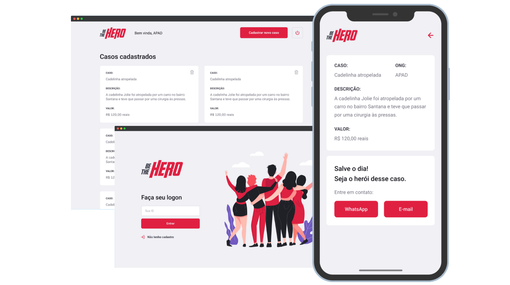

<h2 align="center">
  
   
  <b>Be The Hero!</b>
   
  
  
</h2>

  

## O que é? :love_letter:

> Aplicação, que busca ajuar ONGS de maneira financeira,
> expondo elas aos usuarios que tenham interesse em ajudar

### Ferramentas :hammer:

- **Backend**

  - [Node.js](https://nodejs.org/en/)
  - [express](https://expressjs.com/pt-br/)
  - [Knex](http://knexjs.org/)
  - [Sqlite](https://www.sqlite.org/index.html)

- **Frontend**

  - [React](https://pt-br.reactjs.org/)
  - [Axios](https://github.com/axios/axios)

- **Mobile**
  - [EXPO](https://expo.io/)
  - [Axios](https://github.com/axios/axios)
  - [React-Navigation](https://reactnavigation.org/)

### Testes-Automatizados :ballot_box_with_check:

- [Jest](https://jestjs.io/)

### Autor

| [ @Ryannnkl](https://github.com/Ryannnkl) |
| :--------------------------------------------------------------------------------------------------------------------------------: |

